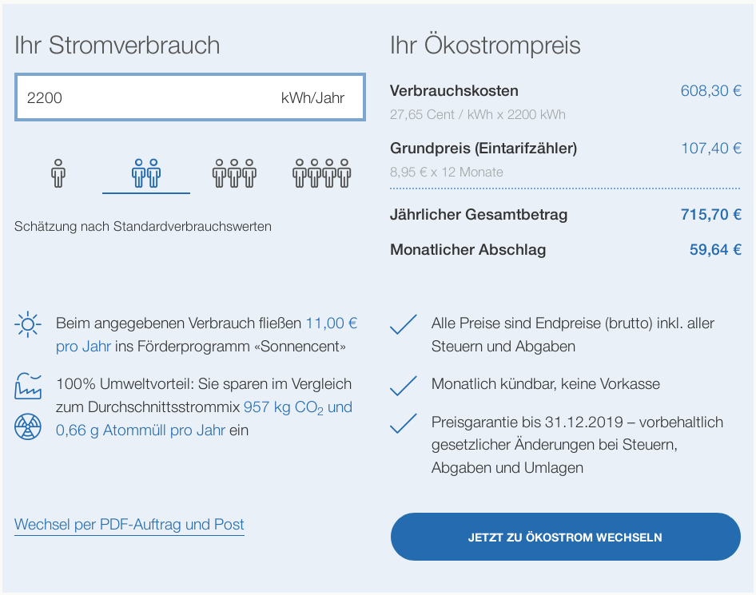

Diese Seite will helfen, fossilen Strom von der Stromrechnung zu verbannen - und das [so günstig wie möglich](#ermittlung-des-guenstigsten-anbieters). 

## Anbieter mit festem Preismodell

Folgende Anbieter haben ein bundesweit einheitliches Preismodell. Ihre Preise sind somit auf einen Blick gut vergleichbar:

| Anbieter | Grundpreis pro Monat[^1] | Strompreis pro KwH[^1] |
|:---------|:--------------------:|:-------------------:|
|[EWS Schönau][1] | 8,95 Euro | 27,65 Cent |
|[Ökostrom+][2]   | 8,95 Euro | 27,65 Cent |
|[Greenpeace Energy][3] | 8,90 Euro | 28,50 Cent |
|[Naturstrom][4] | 8,90 Euro | 28,95 Cent | 

Bei allen diesen Anbietern gibt es **keine** Mindestvertragslaufzeit. Die Freiheit, jederzeit innerhalb des laufenden Monats zu kündigen und zu einem anderen Anbieter zu wechseln bleibt also erhalten.

## Anbieter mit regionalem Preismodell

Strompreise sind hinter den Kulissen eine komplexe Angelegenheit - so wirken sich regional unterschiedliche Faktoren wie Netzentgelte und Konzessionsabgaben auf die Marge obiger Anbieter aus. Die folgenden Anbieter hingegen kalkulieren diese mit in den Endpreis ein, der dann abhängig von der Postleitzahl des jeweiligen Haushaltes berechnet wird:

| Anbieter | Grundpreis   pro Monat[^1] | Strompreis   pro KwH[^1]  | am günstigsten in [^2] [^3] |
|:---------|:--------------------:|:-------------------:|:----------------------------|
|[Bürgerwerke][5] | 8,90 Euro | 27,60 - 31,20 Cent | Düsseldorf, Münster, Stuttgart |
|[Polarstern][6] | 9,80 - 15,84 Euro | 26,35 - 29,85 Cent | Münster, Köln, Bremen |
|[ProEngeno][7] | 2,14 - 14,16 Euro | 24,73 - 29,54 Cent | Düren, Berlin, Dortmund |

Auch bei den [Bürgerwerken][1] und [Polarstern][2] gibt es **keine** Mindestvertragslaufzeit, somit bleibt auch hier die Freiheit erhalten, jederzeit innerhalb des laufenden Monats zu kündigen und zu einem anderen Anbieter zu wechseln.

Bei [ProEngeno][7] beträgt die Mindestvertragslaufzeit hingegen 12 Monate mit einem Monat Kündigungsfrist zum Ende der Laufzeit. In einigen Städten (Berlin, Dresden, Flensburg, Düren, Dortmund) liefert ProEngeno im Vergleich zu anderen Anbietern auf dieser Seite Strom 5 bis 8 Euro pro Monat[^3] günstiger - dies trifft aber auf keinen Fall pauschal auf alle Städte zu! 

Den Einzelfall zu vergleichen kann sich also lohnen - im Zweifelsfall ist aber immer ein Tarif ohne Vertragsbindung zu bevorzugen.

Wie genau der günstigste unter allen diesen Anbietern ermittelt werden kann, steht [weiter unten](#ermittlung-des-guenstigsten-anbieters)

## Auswahl eines Anbieters

Die oben verlinkten Webseiten bieten ausführliche Information über das Profil der einzelnen Unternehmen. Bei der letztendlichen Entscheidung für einen Anbieter können verschiedene Aspekte eine Rolle spielen:

#### Strommix
 * Welche erneuerbaren Energiequellen werden verwendet - Wasser, Sonne, Wind, sonstige?  
    Hier hat jeder Anbieter seinen ganz eigenen Mix.
 * Wo stehen die Anlagen - ausschließlich in Deutschland oder wird auch Strom aus dem      benachbarten Ausland bezogen?

#### Neuanlagenförderung

 * Welche Arten von neuen Anlagen werden (bzw. wurden schon) gebaut und wo?
 * Wie ist der Anbieter an diesen Anlagen beteiligt?

#### Unternehmensstruktur

Handelt es sich um

 * eine Aktiengesellschaft ([Naturstrom][4]), 
 * eine GmbH ([Polarstern][6]) bzw. GmbH & Co. KG ([ProEngeno][7]) oder 
 * eine Genossenschaft ([EWS Schönau][1],       [Bürgerwerke][5], [Greenpeace Energy][3])? 

#### Soziales und gesellschaftliches Engagement

 Viele dieser Anbieter sind nicht nur an einer ökologischen Stromerzeugung interessiert, sondern fördern darüber hinaus unterschiedlichste Projekte im Sinne des Gemeinwohles in Deutschland und weltweit. Diese decken eine Vielzahl von Aspekten ab, von ökologischem Landbau über Bildungsprojekte bis zum Bau von Waisenhäusern - und vieles mehr.

#### Preis

 Nicht zuletzt beruhen Konsumentscheidungen auch auf finanziellen Überlegungen. Wie für einen bestimmten Haushalt der günstigste Anbieter bestimmt werden kann, steht im folgenden Abschnitt.

## Direkt den günstigsten Anbieter ermitteln
{: #ermittlung-des-guenstigsten-anbieters}

Nach Stand der letzten Preisermittlung für diese Seite ({{ page.prices_updated_string }}) müssen nur die Anbieter [EWS Schönau][1] und [Polarstern][6] mithilfe des Tarifrechners auf deren Seiten verglichen werden, um den günstigsten Preis für einen Haushalt zu ermitteln. Sofern eine Vertragsbindung von 12 Monaten kein Ausschlusskriterium ist, kann der Wechsel zu [ProEngeno][7] unter Umständen noch mehr Ersparnis bringen.

> Eine Vertragsbindung sollte gut überlegt sein, da sich solche Verträge nach Versäumnis der Kündigungsfrist automatisch um die Dauer der Mindestvertragslaufzeit verlängern. Es gibt allerdings ein sofortiges Sonderkündigungsrecht, sollte der Anbieter seine Preise erhöhen.

In den Tarifrechner wird einfach der erwartete Jahresverbrauch und - je nach Anbieter - die Postleitzahl des Haushaltes eingetragen. Dort kann zur Preisermittlung beliebig "herumgespielt" werden, um eine Preisermittlung durchzuführen. Keine Angst: hier findet noch kein Vertragsabschluss statt. Denn ein Vertrag kann erst verbindlich zustande kommen, wenn in weiteren Schritten die persönlichen Daten sowie die Zählernummer(n) eingegeben und bestätigt werden.

> Der Jahresverbrauch des eigenen Haushaltes findet sich nebst der Zählernummer(n) auf der Jahresabrechnung des jetzigen Stromanbieters. Liegt (noch) keine Jahresabrechnung vor, geben die Tarifrechner auch gängige Werte für Haushalte verschiedener Größen vor.

### Fragen, Kritik, Anregungen?

Bestehen noch Unklarheiten oder gibt es Anregungen für diese Seite? Dann einfach direkt [eine Email schreiben](&#109;ai&#108;&#116;o&#58;e&#110;&#37;65&#114;%67%69e%&#55;7e&#110;%&#54;&#52;e&#46;s&#101;lbe&#114;&#46;m&#37;61ch&#101;n&#64;g&#37;6Da&#37;69l&#46;&#99;om).

> Diese Webseite wurde erst am 12. März begonnen und wird konstant erweitert. Wir bitten also um etwas Nachsicht, sind aber für jeden Verbesserungsvorschlag dankbar. Ein eigener Tarifrechner für den bequemeren und schnelleren Preisvergleich ist übrigens bereits in Planung.

---

[^1]: Alle Preise inklusive Mehrwertsteuer. Stand: {{ page.prices_updated_string }}
[^2]: günstigste zuerst, aus einem Vergleich von 16 Städten ermittelt
[^3]: basierend auf 3000 kWh Jahresverbrauch (3-Personen-Haushalt)

[1]: https://www.ews-schoenau.de/ 'Zur Webseite von EWS Schönau {{ page.hint_new_tab }}'
[2]: https://www.ökostromplus.de/ 'Zur Webseite von Ökostrom+ {{ page.hint_new_tab }}'
[3]: https://www.greenpeace-energy.de/ 'Zur Webseite von Greenpeace Energy {{ page.hint_new_tab }}'
[4]: https://www.naturstrom.de/ 'Zur Webseite von Naturstrom {{ page.hint_new_tab }}'
[5]: https://buergerwerke.de 'Zur Webseite der Bürgerwerke {{ page.hint_new_tab }}'
[6]: https://www.polarstern-energie.de/ 'Zur Webseite von Polarstern Energie {{ page.hint_new_tab }}'
[7]: https://proengeno.de/ 'Zur Webseite von ProEngeno {{ page.hint_new_tab }}'

